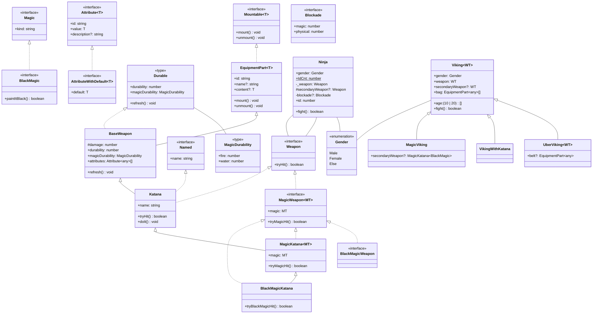

# TsUML2 [](https://badge.fury.io/js/tsuml2) [](https://snyk.io/test/npm/tsuml2)

Generate UML diagram for your TypeScript applications powered by nomnoml.

TsUML2 works offline, so no third party servers are involved.
It supports
- classes
- interfaces
- enums
- type literals


## Installation

```sh
npm install -g tsuml2
```

## Usage

```
tsuml2 --glob "./src/**/*.ts" 
```
By default tsuml2 assumes that the required `tsconfig.json` file resides in the current directoy
if this is not the case use the tsconfig parameter: 
```sh
--tsconfig "./somewhere/tsconfig.alt.json"
```


To avoid getting unwanted interfaces / classes you might want to exclude d.ts and spec.ts files:
```sh
tsuml2 --glob "./src/**/!(*.d|*.spec).ts"
```

### Options
```
      --help                Show help                                  [boolean]
      --version             Show version number                        [boolean]
  -g, --glob                pattern to match the source files (i.e.:
                            ./src/**/*.ts)                   [string] [required]
      --tsconfig            the path to tsconfig.json file
  -o, --outFile             the path to the output file     [default: "out.svg"]
      --propertyTypes       show property types and method return types
                                                       [boolean] [default: true]
      --modifiers           show modifiers like public,protected,private,static
                                                       [boolean] [default: true]
      --typeLinks           add links for classes, interface, enums that point
                            to the source files        [boolean] [default: true]
      --nomnoml             nomnoml layouting and styling options (an array of
                            strings, each representing a nomnoml line), i.e.:
                            --nomnoml "#arrowSize: 1" "#.interface: fill=#8f8
                            dashed"                                      [array]
      --outDsl              the path to the output DSL file (nomnoml)   [string]
      --mermaid             mermaid layouting and styling options (an array of
                            strings, each representing a mermaid line), i.e.:
                            --mermaid "direction LR"                     [array]
      --outMermaidDsl       the path to the output mermaid DSL file     [string]
  -m, --memberAssociations  show associations between classes, interfaces, types
                            and their member types    [boolean] [default: false]
      --exportedTypesOnly   show only exported types, classes, interfaces, enums
                                                      [boolean] [default: false]
      --config              path to a json config file (command line options can
                            be provided as keys in it)                  [string]
```

an example config.json could look like:
```json
{
  "glob": "./src/**/!(*.d|*.spec).ts",
  "modifiers": false,
  "nomnoml": ["#arrowSize: 1.5","#.interface: fill=#8f8 dashed"]
}
```

> **_NOTE:_** command line arguments override those provided in config.json

## Direct output of nomnoml and mermaid code
You can output the diagram not only as svg but also
as _nomnoml_ and _mermaid_ code.

### Generate nomnoml DSL output

```sh
tsuml2 --glob "./src/demo/**/*.ts" --outDsl  "./assets/nomnoml_diagram.dsl"
```
results in the following nomnoml code stored in `nomnoml_diagram.dsl`:
```nomnoml
#.interface: fill=lightblue
#.enumeration: fill=lightgreen
#.type: fill=lightgray
[<interface>Weapon||+tryHit(): boolean]
[<interface>Named|+name: string|]
[<interface>Magic|+kind: string|]
[<interface>BlackMagic||+paintItBlack(): boolean]
[<interface>MagicWeapon<MT>|+magic: MT|+tryMagicHit(): boolean]
[<interface>BlackMagicWeapon||]
[<enumeration>Gender|Male;Female;Else]
[<type>MagicDurability|+fire: number;+water: number|]
[<type>Durable|+durability: number;+magicDurability: MagicDurability|+refresh(): void]
[Magic]<:--[BlackMagic]
[Weapon]<:--[MagicWeapon<MT>]
[MagicWeapon<MT>]<:--[BlackMagicWeapon]
[BaseWeapon|#damage: number;+durability: number;+magicDurability: MagicDurability;+attributes: string\[\]|+refresh(): void]
[Katana|+name: string|+tryHit(): boolean;+doIt(): void]
[MagicKatana<MT>|+magic: MT|+tryMagicHit(): boolean]
[BlackMagicKatana||+tryBlackMagicHit(): boolean]
[Durable]<:--[BaseWeapon]
[BaseWeapon]<:-[Katana]
[Weapon]<:--[Katana]
[Named]<:--[Katana]
[Katana]<:-[MagicKatana<MT>]
[MagicWeapon<MT>]<:--[MagicKatana<MT>]
[MagicKatana<MT>]<:-[BlackMagicKatana]
[MagicWeapon<MT>]<:--[BlackMagicKatana]
[Ninja|+gender: Gender;+static IdCnt: number;-_weapon: Weapon;+id: number|+fight(): boolean]
[Viking<WT>|+gender: Gender;+weapon: WT|+fight(): boolean]
[UberViking<WT>||]
[VikingWithKatana||]
[Viking<WT>]<:-[UberViking<WT>]
[Viking<WT>]<:-[VikingWithKatana]
```

### Generate mermaid DSL output

```sh
tsuml2 --glob "./src/demo/**/*.ts" --outMermaidDsl  "./assets/mermaid_diagram.dsl"
```
stores the mermaid code to `mermaid_diagram.dsl`.

> **_Note:_** You can use it directly in github markdown!



## Usage in Node Applications:


```js
 const {createDiagram, TsUML2Settings} = require('tsuml2')

 const settings = new TsUML2Settings();
 settings.glob = `./src/app/**/!(*.d|*.spec).ts`;
 settings.outFile = 'd:/apps/src/demo.svg'
 createDiagram(settings); 
```


## Examples
### Demo Diagram

```sh
tsuml2 --glob "./src/demo/**/*.ts" -o "./assets/uml_diagram.svg"
```

The diagram generated for the code under the [demo folder](https://github.com/demike/TsUML2/tree/master/src/demo) looks as follows:


### A complex command line parameter example:
```
./tsuml2 --glob=./src/demo/**/*.ts --nomnoml "#arrowSize: 1.5" "#.interface: fill=#8f8 dashed" --modifiers false --propertyTypes false
```


### With type links enabled: [live example](https://raw.githubusercontent.com/demike/TsUML2/master/assets/uml_diagram.svg)


### With member associations enabled:
Associations between class / interfaces / types and their members
are represented by lines without arrows.
The associations also include multiplicity ("0..*").

Use the `-m` parameter to enable output of member associations.
 
```sh
tsuml2 --glob "./src/demo/**/*.ts" -m -o "./assets/uml_diagram.svg"
```

